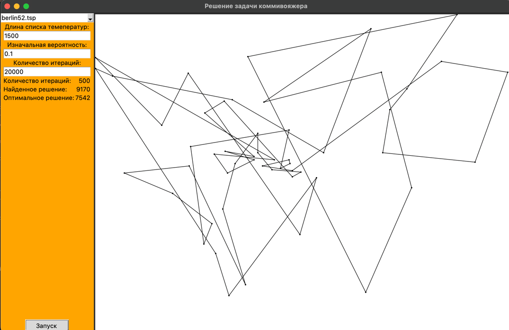
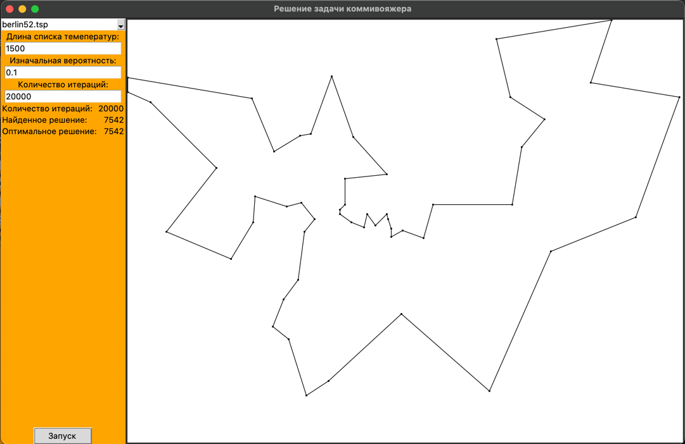

# List-based simulated annealing algorithm
Реализация алгоритма имитации отжига для решения задачи о коммивояжере, представленного в статье: Shi-hua Zhan, Juan Lin, Ze-jun Zhang, Yi-wen Zhong - List-Based Simulated Annealing Algorithm for Traveling Salesman Problem

## Скриншоты

<figure>
  
  <figcaption><strong>Рис. 1.</strong>Интерфейс и решение задачи "berlin52" на 500 итерации </figcaption>
</figure>

<figure>
  
  <figcaption><strong>Рис. 2.</strong>Интерфейс и оптимальное решение задачи "berlin52"</figcaption>
</figure>

## Требования
- Python 3.13 (_Совместимость с ранними версиями не проверялась_)

## Установка и использование
Установите данный репозиторий при помощи git.

Запустите main.py файл: 

```bash
  python main.py  
```

В появившемся окне вы можете выбрать задачу из списка предустановленных или загрузить свою (описано ниже), также вы можете 
установить несколько параметров для алгоритма: 
- Длина списка температур (temp_len): чем больше температур, тем больше вероятность перейти в
другое состояние (даже если оно хуже текущего). Большое значение данного параметра помогает избегать локальных минимумов, но
избыточно большое значение может привести к тому, что алгоритм не сойдется;
- Изначальная вероятность (p0): чем больше значение вероятности, тем выше изначальные температуры. Соответственно, большие значения 
вероятности позволяют избежать локальных минимумов, но при этом отрицательно влияют на скорость сходимости алгоритма
- Количество итераций (outer_loop): количество итераций. Вы можете увеличить количество, если алгоритм не сходится

Также вы можете использовать солвер, расположенный в модуле solver.py, отдельно от интерфейса, передав в него указанные выше параметры, а также матрицу расстояний: 

```python
import solver

solver = solver.TSPSolver(
    temp_len,
    p0, 
    outer_limit,
    distance_matrix
)
answer = solver.run()
```

## Выбор задачи

------

Некоторые из задач уже есть в проекте для демонстрации его работы и расположены в папке data/benchmarks/ данного проекта.
Вы можете добавить свои задачи (условия задач можно найти здесь: http://comopt.ifi.uni-heidelberg.de/software/TSPLIB95/tsp/), поместив их 
в указанную папку.


